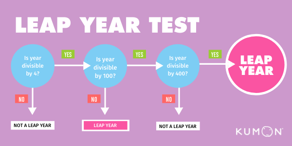
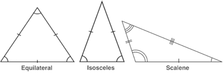

## Tasks

### Task #1

Home Can you create a Program I will give you number(userinput and print table)

```f"{}" String format concept
User input - num int -> 10, 100, -1, 2, 3.14 -> input
9x1 = 9
9x2 = 18... till 10
```

### Task #2
Create a program , take 2 inputs from the user num1, num2 and give them

```
max
pow num1 to num2
sub, mul, sum, div.
Format your out with f{""}
```

### Task #3

- Explain the difference between the = operator and the == operator in Python.
- What does the ** operator do in Python, and how is it used?
- What does the ^ operator do in Python, and in what context is it commonly used?


### Task #4

- Write a Python program to calculate the area of a circle given its radius using the formula ``` area=π×r^2``` ( Take pie as 3.14)

### Task #5

- Create a program that takes two numbers as input and prints whether the first number is greater than, less than, or equal to the second number.

### Task #6
- Develop a Python script that calculates the square and cube of a given number.

-- 

### Task #7
✅ Leap Year Checker:



Create a program that determines whether a given year is a leap year. 
A leap year is divisible by 4, but not by 100 unless it is also divisible by 400.
Use an if-else statement to make this determination.

### Task #8
✅ Triangle Classifier:





Write a program that classifies a triangle based on its side lengths. 
Given three input values representing the lengths of the sides, 
determine if the triangle is equilateral (all sides are equal), 
isosceles (exactly two sides are equal), or scalene (no sides are equal). 
Use an if-else statement to classify the triangle.


### Task #9
✅ FizzBuzz Test:
Write a program that prints numbers from 1 to 100. # Loop For
However, for multiples of 3, print "Fizz" instead of the number, and
for multiples of 5, print "Buzz." 
For numbers that are multiples of both 3 and 5, print "FizzBuzz."


## Todo 
- What is the difference with list and tuple?
- is - this operator Java (list)